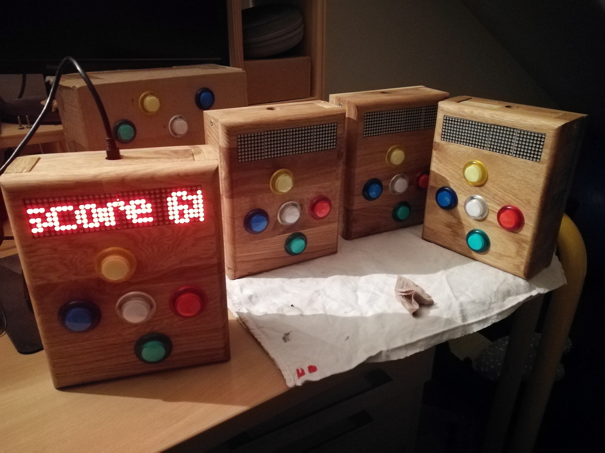

# Gametoy

A hand-crafted wooden box running games on an STM32 microcontroller — built as a Christmas 2024 gift.

It features 5 illuminated buttons, a 32×8 LED dot matrix display, and a piezo buzzer. Games include a Simon-like memory game, reaction tests, a traffic avoidance game, and more.

## Repository structure

| Directory | Description |
|-----------|-------------|
| `firmware/` | Embedded C firmware — Zephyr RTOS on STM32F051. See `firmware/README.md` for build instructions. |
| `docs/` | Jekyll website hosted on GitHub Pages. See `docs/CLAUDE.md` for local dev instructions. |

## Links

- [Project website](https://adri1mart1.github.io/gametoy)
- [License](firmware/LICENSE) — Apache 2.0
